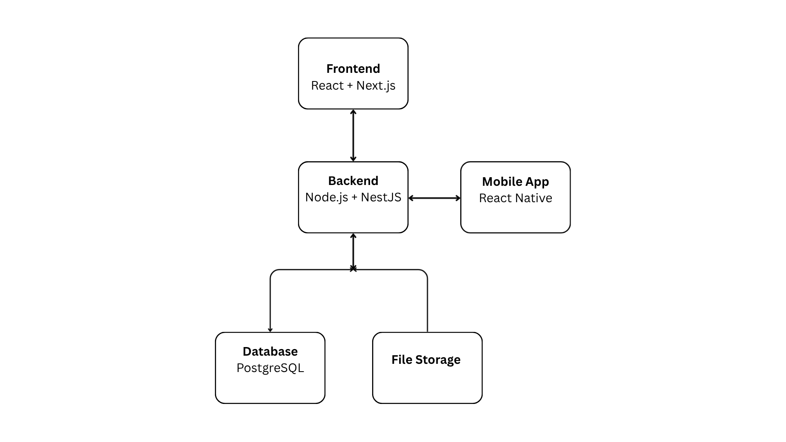

# HelpHire System Architecture

## Overview

HelpHire is a web and mobile platform that connects Users/clients with domestic service providers (helps) like cleaners, nannies, and artisans. The architecture is simple and designed to help engineers start quickly using managed services and minimal setup.

---

## Core Components

1. **Frontend (Web)**

   * Built with React and Next.js.
   * Provides access for users on desktop and browsers.
   * Handles user login, booking, chat, and notifications.

2. **Mobile App**

   * Built with React Native for both Android and iOS.
   * Offers the same key features as the web app: signup, search, booking, messaging, and job tracking.
   * Connects to the same backend APIs as the web platform.

3. **Backend (API Server)**

   * Built with Node.js and NestJS.
   * Handles user authentication, service listings, bookings, and messaging.
   * Connects with payment and notification services.

4. **Database**

   * Managed PostgreSQL.
   * Stores users, providers, bookings, payments, and reviews.

5. **File Storage**

   * Storage for images and documents.
   * Accessed through image URLs.

6. **Payments**

   * Integrated with Paystack or Flutterwave.
   * Supports escrow flow: client pays → job done → provider gets paid.

7. **Notifications**

   * Managed push and SMS service for alerts, booking updates, and reminders.

8. **Admin Panel**

   * Simple web dashboard for managing users, bookings, and support tickets.

---

## Communication Flow

1. User (on web or mobile) requests a service/helper.
2. The frontend or mobile app sends an API request to the backend.
3. The backend retrieves or updates data in PostgreSQL.
4. The payment gateway processes transactions and notifies the backend.
5. The backend returns the request to the frontend where it's displayed the user.
6. Admin monitors and manages activities through the dashboard.

---

## Technical Feasibility

This structure will work because using react for the frontend makes the user interface user-friendly, Node.js and PostgreSQl for the backend and database respectively because they are scalable, fast and flexible.

## Diagram

Figure 1: HelpHire System Architecture Diagram
